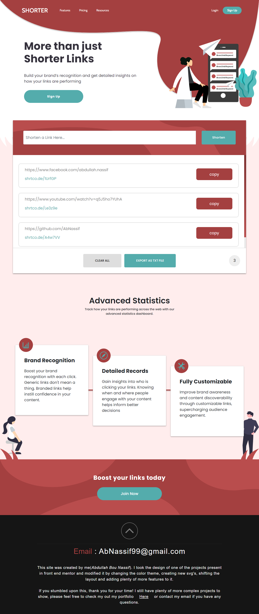

# SHORTER - URL-SHORTENER 
**scroll down for the full page screenshot!**

Live Link: abnassif.github.io/url-shortener/

I had a blast with this project, it has helped me learn alot about different concepts as I was refactoring the code to make it more readable and efficient. feel free to check it out, mess around with the viewport and check out how easy it is to use.

Ps. I added a feature where you can export all your url's as a txt file!

If you're seeing this, thank you for your time! Feel free to reach me out on my email **abnassif99@gmail.com** if you have any questions. 

